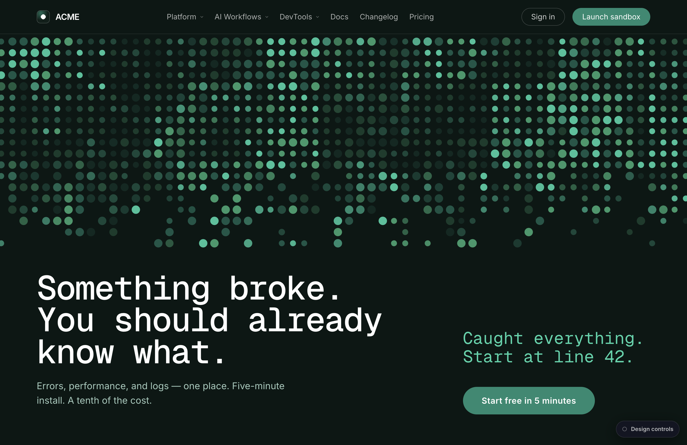

# Hero Lab

**Hero & landing-page lab — swappable shader backgrounds with a live control panel.**

A browser lab for exploring hero sections. Pick a hero, tune every parameter live, and
share the exact look via URL. Built as a registry of heroes so new backgrounds (shader,
3D, gradient) drop in as entries — not new projects.

**First hero: Dither** — a full-bleed dot-field / dithering-shader scene with a
**Problem ⇄ Fix** state pair and warp-reveal-on-hover.



## Run it

```bash
npm install
npm run dev     # → http://localhost:5173
```

```bash
npm run build   # production build to dist/
npm run preview # serve the build
```

## Dither — the two states

Dither is **one scene driven by a single state flag** — not two heroes.

| State | URL | At rest | Hover reveals |
|-------|-----|---------|---------------|
| **Fix** (default) | `/` | Green field — *"Caught everything."* | The pink **problem** + error-log tooltip |
| **Problem** | `/?state=problem` | Pink error field — *"Something broke."* | The green **fix** + recovery tooltip |

Hover the field and sweep the cursor — warped pixel-circle tiles punch through to the
alternate state, with short error/recovery log fragments trailing below the cursor.

## The control panel

Click **Design controls** (bottom-right) → **Inspector** to open the panel, or press
`⌘/Ctrl + Shift + E`. It drives the live scene:

- **Scene** — Initial State (Problem / Fix), scene templates
- **Dithering shader** — back color, alpha layers (swirl / wave / dots), color cycle, dither type
- **Motion** — speed, frame
- **Sizing** — fit (none / contain / cover), scale
- **Pixel grid** — cell size, divisions, gap, radius, snap
- **Warp reveal** — hover shape, error-text pools, recolor / overlay modes
- **Top start / section edge** — where the field begins and how it dissolves
- **Baseline lock** — snap the right column to the left column's baselines

**Export / Copy Config** serialize the current tuning so a look can be pinned back into code.

> State is in-memory only (no persistence) — a reload resets to the Dither defaults.

## URL params

Injected into the active hero's store *before* React mounts, so the first render is already correct:

```
/?hero=<id>&state=<problem|fix>&copy=<id>&scene=<id>&theme=<id>&preset=<id>
```

`hero` picks the registry entry (default `dither`); `preset` picks the header content
(default `neutral`).

## Stack

- **Vite 7** + **React 19** + **TypeScript**
- **Tailwind CSS v4** (via `@tailwindcss/vite`) — the `t-*` color tokens live in `src/index.css`
- **@paper-design/shaders-react** — the `Dithering` shader (WebGL2)
- **web-haptics** — subtle haptic feedback on interaction

## Layout

```
src/
  main.tsx                  mounts <HeroLab/>
  index.css                 Tailwind + fonts + t-* design tokens
  lab/
    HeroLab.tsx             shell: header + hero switcher + docked panel + ?hero routing
    registry.ts             heroes = [{ id:'dither', component, applyUrlParams }]
  heroes/
    dither/
      DitherHero.tsx        the scene (dot field, warp reveal, copy block)
      ditherStore.ts        state, scene templates, presets (useSyncExternalStore)
      DitherPanel.tsx       the control panel body
      urlParams.ts          reads ?state/scene/copy/theme into the store pre-mount
  content/
    presets.ts              header brand + nav (neutral default), swappable
  components/playground/    TextInspectorPanel, TextInspectorContext, PaletteColorPicker,
                            useTextSelection, useApplyOverrides
  themes/    fonts.ts, terminalThemes.ts
  utils/     colorContrast.ts
```

## Adding a hero

1. Build the component under `src/heroes/<id>/`.
2. Add one entry to `src/lab/registry.ts` (`id`, `name`, `engine`, `component`, optional
   `applyUrlParams`).

That's it — the hero switcher and `?hero=<id>` routing pick it up automatically (the
switcher UI appears once there are 2+ heroes).

## Roadmap

- **Now:** Dither (shader engine) + registry + lab shell + neutral content preset.
- **Next:** a second engine (3D via react-three-fiber, or more `@paper-design` shaders) to
  exercise the registry; hero-layout templates (split / centered / left-rail).

## Notes

- The panel's top-left badge reads the store's own state label, independent of the URL —
  a harmless cosmetic detail.
- Dither began as a hero in a devtools homepage exploration; all content here is neutral
  (ACME placeholder) and swappable via `src/content/presets.ts`.
