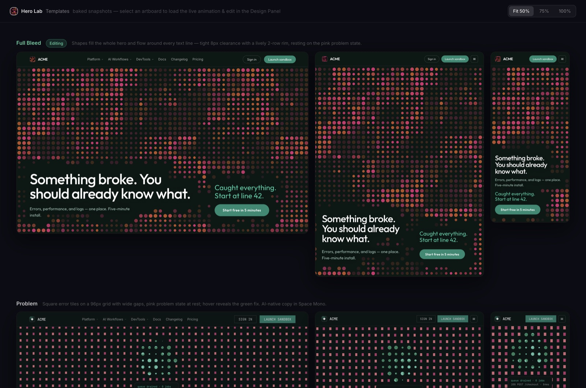
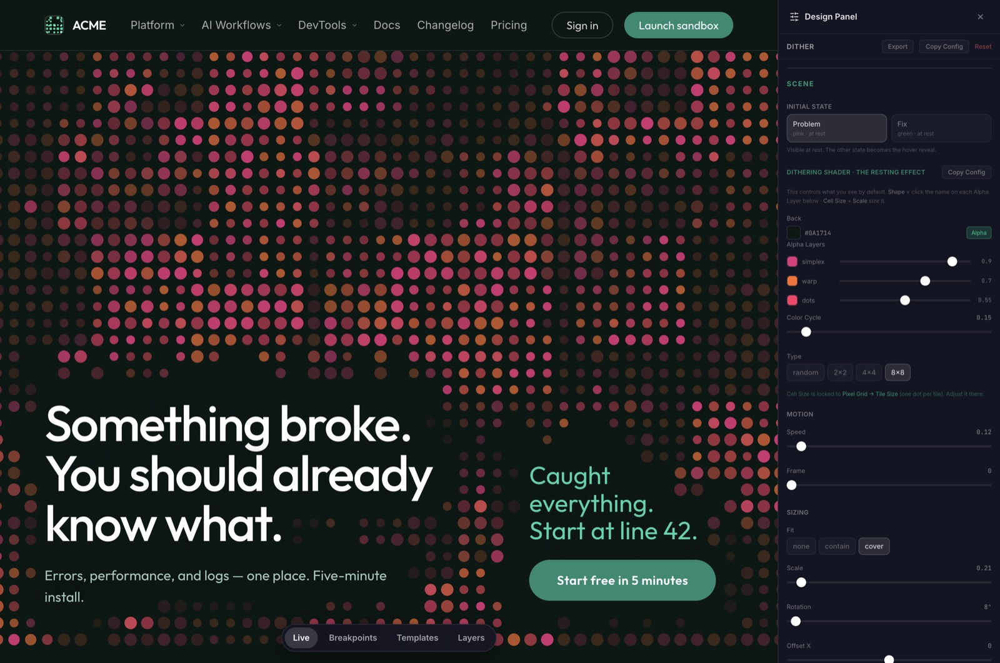

# Hero Lab

**A browser lab for hero sections.** Tune a shader background live, see it at every
breakpoint, and share the exact look as a URL.

### [→ Open the live lab](https://hero-lab.netlify.app)



The background is a real WebGL dithering shader, not an image. Every dot, colour and motion
value is wired to a control, so you can push a section around until it looks right — then
copy the config straight into code.

It exists because "what does this hero actually look like at 320px, in motion?" is a
question that normally costs a build, a deploy and a screenshot. Here it costs a drag.

---

## Try it

```bash
npm install
npm run dev      # → http://localhost:5173/hero-lab/
```

Press <kbd>⌘</kbd>/<kbd>Ctrl</kbd> + <kbd>Shift</kbd> + <kbd>E</kbd> — or click **Design
controls** — to open the panel and start moving sliders. Nothing is saved; reload for a
clean slate.

## What you can do

**Hover the dot field and sweep the cursor.** Warped pixel tiles punch through to the
opposite state — the green "fixed" field under the pink "broken" one, or the reverse — with
short log fragments trailing the cursor.

**Switch views** with the pill at the bottom:

| View | What it's for |
|------|---------------|
| **Templates** | Every template as an artboard, at all three widths. Where the lab opens. Click one to make it live |
| **Live** | The hero at your window size — the main working surface |
| **Breakpoints** | Desktop, tablet and phone side by side, each a real iframe at native width, so media queries and the shader behave exactly as they would on the device |
| **Layers** | The scene taken apart — each setting added one at a time, so you can see what it contributes |

**Three templates** ship in the box — *Full Bleed*, *Problem* and *Fine Grain* — plus eleven
motion presets (Orbit, Radar, Error Sweep, Breath…) that change the movement without
touching the layout.



Everything in the panel drives the live scene: the shader's colours and alpha layers, the
motion, the pixel grid, the hover reveal, where the field starts and how it dissolves into
the page. **Export** and **Copy Config** serialize the current tuning so a look can be
pinned back into code.

## Share a look

Every view is a URL, applied before the first frame renders — so a shared link opens on the
look you meant, with no flash of the default.

```
?template=full-bleed&state=problem&scene=radar-scan
```

| Param | Does |
|-------|------|
| `template` | `full-bleed`, `problem`, `fine-grain` |
| `state` | `problem` or `fix` — which state rests on top |
| `scene` | motion preset: `orbit`, `radar-scan`, `error-sweep`, … |
| `logo` | pins the generative logo to one formation, e.g. `?logo=8f3a` |

## The logo rolls itself

The mark in the header is the same shader as the hero, at 28px, seeded once per visit — so
it draws a different formation every time you load the page. **Click it to roll another
one.** Reduced-motion visitors get a unique formation too, frozen rather than animating.

## Built on Paper Design's shaders

The dithering shader — the thing that actually makes the background move — is
**[@paper-design/shaders](https://github.com/paper-design/shaders)** by
**[Paper Design](https://paper.design)**. Free, open source, MIT.

Being precise about the split: Paper Design wrote the shader. Hero Lab wires its parameters
to controls and adds the pixel-grid masking, the hover reveal, the breakpoint and artboard
views, and the URL serialization. If you just want the shader, take it from them directly —
it stands up fine without any of this:

```bash
npm install @paper-design/shaders-react
```

Their [shader playground](https://shaders.paper.design) is the better starting point for
exploring the rest of the library.

## Under the hood

Vite 7, React 19, TypeScript, Tailwind v4, and Paper Design's shaders. Four runtime
dependencies, on purpose.

For how it's put together — the view architecture, adding a new hero, the generative logo's
compositing, and the deploy setup — see **[docs/architecture.md](docs/architecture.md)**.

```bash
npm run typecheck
npm run build    # production build → dist/
npm run preview  # serve that build
```

## License

[MIT](LICENSE) — © 2026 Gleb Stroganov.

`@paper-design/shaders` is separately MIT licensed, © 2024 Lost Coast Labs, Inc.
(Paper Design).

---

**Gleb Stroganov** — design engineer at [Evil Martians](https://evilmartians.com), building
developer tools and AI agent interfaces. Lisbon.

[**glebstroganov.com**](https://glebstroganov.com) · [GitHub](https://github.com/strongeron) · [X](https://x.com/strongeron)

More in the same vein: [Sound Playground](https://glebstroganov.com/sound-playground/) — a
modular synth in the browser.
